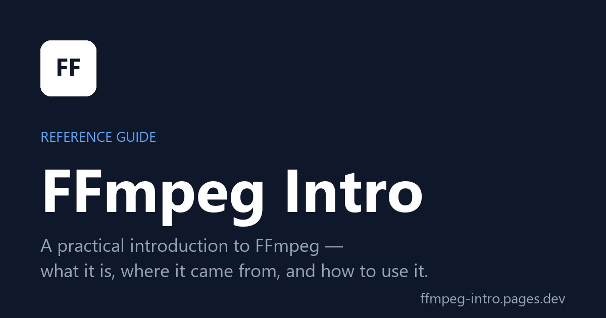

# FFmpeg Intro

A practical, single-page introduction to [FFmpeg](https://ffmpeg.org/) — what it is, where it came from, and how to use it for the most common audio and video tasks. Built around real command examples you can adapt as you go.

## Access FFmpeg Intro

- **Live:** https://ffmpeg-intro.pages.dev
- **Locally:** clone the repo and open `index.html` in any modern browser. It's a single self-contained file — no build step, no server needed.

## What's inside

- Key concepts: command structure, streams inside a container, container vs. codec
- Install notes (Windows via gyan.dev; pointer to the official downloads for Linux / macOS)
- A flag cheat-sheet
- Common operations: convert, resize, extract / remove audio
- Capturing from a device (Windows DirectShow)
- Cut, crop, snapshot, frame-level work
- CPU vs GPU encoding
- Metadata and FFprobe basics
- Measuring perceptual video quality with **VMAF**
- An appendix covering common error messages, performance tuning & presets, and a glossary

Each command example has an *Explain this command* expandable panel that breaks down every flag.

## Features

- Light / dark theme toggle
- Sticky table of contents with active-section highlighting
- Click-to-copy on every code block
- Copyable deep links on every heading

## Updates

This is a living reference — sections get added or rephrased over time. The "Updated" date in the hero and footer reflects the last revision.

## Suggestions or fixes

Open an issue or pull request — corrections, clarifications, and additional examples are welcome.

## License

Released under the [MIT License](LICENSE).
